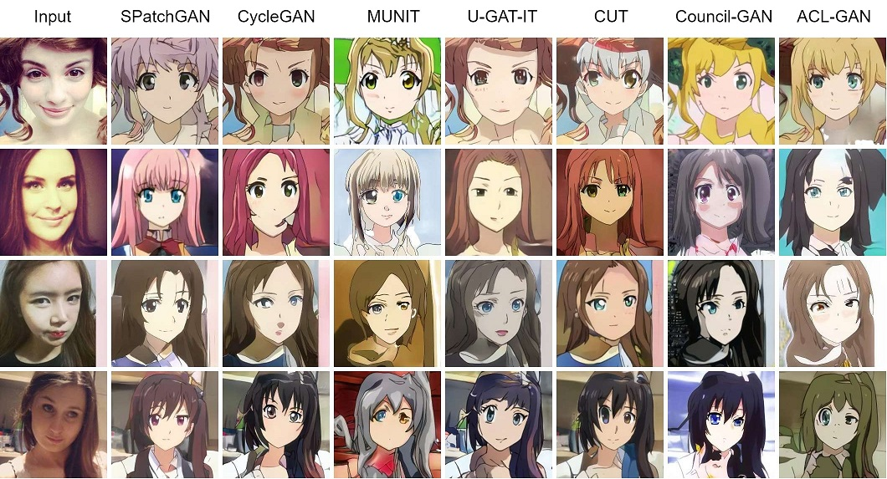
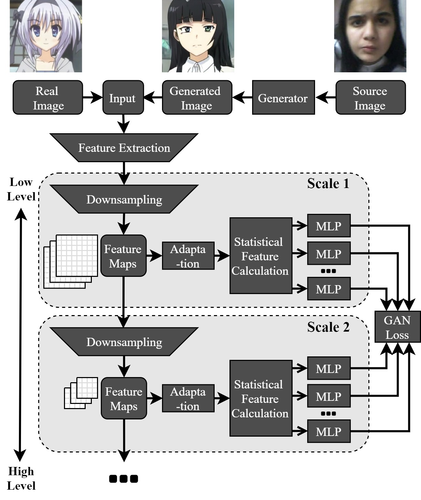

## SPatchGAN: Official TensorFlow Implementation

### Paper
"SPatchGAN: A Statistical Feature Based Discriminator for Unsupervised Image-to-Image Translation"  (ICCV 2021)

[](https://arxiv.org/abs/2103.16219)
[](https://www.youtube.com/watch?v=JY7eq6q5qpk)
[](https://drive.google.com/file/d/1r62hIUkQrQGE_6PI_ovS4sdfHPjfSfIK/view?usp=sharing)



<br><br>



### Web Demos
<a href="https://replicate.ai/netease-gameai/spatchgan-selfie2anime"></a> by [CJWBW](https://github.com/CJWBW)


### Environment
- CUDA 10.0
- Python 3.6
- ``pip install -r requirements.txt``

### Dataset

- Dataset structure (dataset_struct='plain')
```
- dataset
    - <dataset_name>
        - trainA
            - 1.jpg
            - 2.jpg
            - ...
        - trainB
            - 3.jpg
            - 4.jpg
            - ...
        - testA
            - 5.jpg
            - 6.jpg
            - ...
        - testB
            - 7.jpg
            - 8.jpg
            - ...
```

- Supported extensions: jpg, jpeg, png
- An additional level of subdirectories is also supported by setting dataset_struct to 'tree', e.g.,
```
- trainA
    - subdir1
        - 1.jpg
        - 2.jpg
        - ...
    - subdir2
        - ...
```

- Selfie-to-anime:
     - The dataset can be downloaded from [U-GAT-IT](https://github.com/taki0112/UGATIT).

- Male-to-female and glasses removal:
     - The datasets can be downloaded from [Council-GAN](https://github.com/Onr/Council-GAN).
     - The images must be center cropped from 218x178 to 178x178 before training or testing.
     - For glasses removal, only the male images are used in the experiments in our paper. Note that the dataset from Council-GAN has already been split into two subdirectories, "1" for male and "2" for female.

### Training

- Set the suffix to anything descriptive, e.g., the date.
- Selfie-to-Anime
```bash
python main.py --dataset selfie2anime --augment_type resize_crop --n_scales_dis 3 --suffix scale3_cyc20_20210831 --phase train
```

- Male-to-Female
```bash
python main.py --dataset male2female --cyc_weight 10 --suffix cyc10_20210831 --phase train
```

- Glasses Removal
```bash
python main.py --dataset glasses-male --cyc_weight 30 --suffix cyc30_20210831 --phase train
```
- Find the output in ``./output/SPatchGAN_<dataset_name>_<suffix>``
- The same command can be used to continue training based on the latest checkpoint.
- For a new task, we recommend to use the default setting as the starting point, and adjust the hyperparameters according to the [tips](docs/tips.md).
- Check [configs.py](configs.py) for all the hyperparameters.

### Testing with the latest checkpoint
- Replace ``--phase train`` with ``--phase test``

### Save a frozen model (.pb)
- Replace ``--phase train`` with ``--phase freeze_graph``
- Find the saved frozen model in ``./output/SPatchGAN_<dataset_name>_<suffix>/checkpoint/pb``

### Testing with the frozon model
```bash
cd frozen_model
python test_frozen_model.py --image <input_image_or_dir> --output_dir <output_dir> --model <frozen_model_path>
```

### Pretrained Models
- Download the pretrained models from [google drive](https://drive.google.com/drive/folders/1uU0pUp8dnLikW4twuuFUelPSgLQGt2fF?usp=sharing), and put them in the output directory.
- You can test the checkpoints (in ./checkpoint) or the frozen models (in ./checkpoint/pb). Either way produces the same results.
- The results generated by the pretrained models are slightly different from those in the paper, since we have rerun the training after code refactoring.
- We set ``n_scales_dis`` to 3 for the pretrained selfie2anime model to further improve the performance. It was 4 in the paper. See more details in the [tips](docs/tips.md).
- We also provide the generated results of the last 100 test images (in ./gen, sorted by name, no cherry-picking) for the calibration purpose.

### Other Implementations
- We provide a PyTorch implementation of the SPatchGAN discriminator in [spatchgan_discriminator_pytorch.py](https://gist.github.com/NetEase-GameAI/6b93a3fa4c8ab7a59a75eeacca33712f).

### Citation
```
@InProceedings{Shao_2021_ICCV,
    author    = {Shao, Xuning and Zhang, Weidong},
    title     = {SPatchGAN: A Statistical Feature Based Discriminator for Unsupervised Image-to-Image Translation},
    booktitle = {Proceedings of the IEEE/CVF International Conference on Computer Vision (ICCV)},
    month     = {October},
    year      = {2021},
    pages     = {6546-6555}
}
```

### Acknowledgement
- Our code is partially based on [U-GAT-IT](https://github.com/taki0112/UGATIT).
